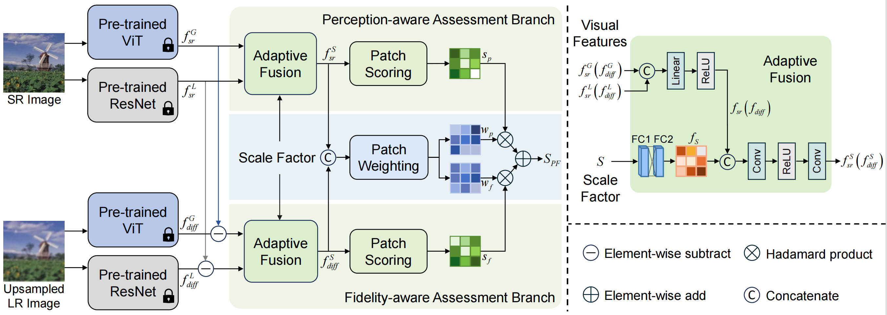

<div align=center>
  
# Perception- and Fidelity-aware Reduced-Reference Super-Resolution Image Quality Assessment

</div>

## Overview
<p align="center">  </p>

## Acknowledgment
The codes are based on [AHIQ](https://github.com/IIGROUP/AHIQ). Thanks for their awesome works.

## Citation
```bibtex
@article{lin2024perception,
  title={Perception-and Fidelity-aware Reduced-Reference Super-Resolution Image Quality Assessment},
  author={Lin, Xinying and Liu, Xuyang and Yang, Hong and He, Xiaohai and Chen, Honggang},
  journal={IEEE Transactions on Broadcasting},
  year={2024},
  publisher={IEEE}
}
```

## Contact
For any question about our paper or code, please emial `linxinying@stu.scu.edu.cn`.


